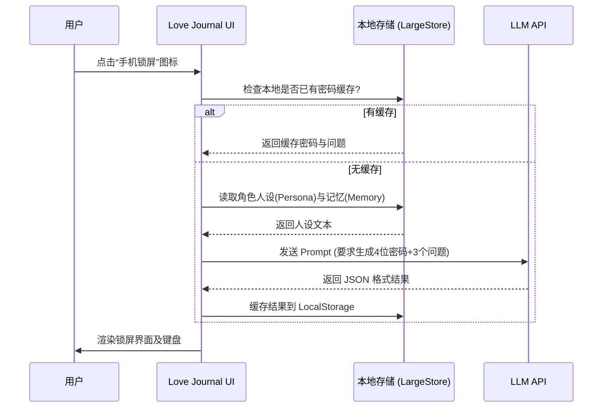
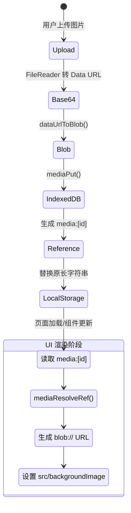

# 布丁酱机 (Candy OS) 技术文档与索引系统

## 1. 项目整体架构说明

本项目（布丁酱机 / Candy OS）是一个纯前端的单页 Web 应用（PWA），通过模拟手机操作系统（Candy OS）的形式，提供与虚拟角色（TA）互动的沉浸式体验。

### 架构分层
*   **表现层 (UI Layer)**：基于原生 HTML5 + CSS3 + Vanilla JavaScript，实现拟物化的手机界面（桌面、Dock栏、状态栏、应用弹窗等）。
*   **逻辑层 (Logic Layer)**：负责核心业务处理，包括：组件生命周期、DOM 事件绑定、AI 对话生成逻辑、后台定时任务（保活与推送通知）。
*   **存储层 (Storage Layer)**：
    *   **IndexedDB**：用于存储大文本（如世界书、长记忆、聊天历史）和二进制媒体文件（图片 Blob），解决 LocalStorage 容量限制。
    *   **LocalStorage**：用于存储轻量级配置（API 密钥、系统设置、角色元数据映射）。
*   **网络通信层 (Network Layer)**：直接向用户配置的兼容 OpenAI 格式的 API 接口发送请求。
*   **服务层 (Backend Layer)**：仅提供一个极简的 Python HTTP 服务器 (`server.py`)，用于本地开发或局域网内的静态资源托管，不包含任何业务逻辑。

### 模块交互关系
1.  **用户操作 -> 逻辑层**：用户在界面交互（点击应用、发送消息）。
2.  **逻辑层 <-> 存储层**：读取本地配置和历史记录，保存新生成的内容或图片缓存。
3.  **逻辑层 <-> 外部 API**：将角色人设、记忆与用户输入打包，调用外部大模型 API 获取响应。

---

## 2. 核心功能模块详细说明

### 2.1 大文件/文本存储模块 (`largeStore`)
**位置**：`script.js` (行 5-85)
**职责**：通过 IndexedDB + 内存缓存，实现大文本的异步持久化与同步快速读取。
*   `initCache()`: 初始化时将 DB 中的所有键值对加载到内存缓存中。返回 `Promise<void>`。
*   `put(key, value)`: 将数据同时写入缓存和 IndexedDB。返回 `Promise<boolean>`。
*   `get(key, defaultVal)`: 同步从内存缓存中获取数据。
*   `getAll()`: 异步获取所有数据字典。
*   `remove(key)`: 从缓存和 DB 中删除指定键的数据。

### 2.2 媒体文件存储模块 (`media DB`)
**位置**：`script.js` (行 240-305)
**职责**：将 Base64 数据图转为 Blob 存入 IndexedDB，生成 `media:id` 引用格式供 UI 使用，避免占用 LocalStorage 额度。
*   `mediaPut(id, blob)`: 将 Blob 存入数据库。
*   `mediaGet(id)`: 获取 Blob 数据。
*   `mediaSaveFromDataUrl(lsKey, dataUrl)`: 将 Data URL 转存并返回 `media:id` 引用字符串。
*   `mediaResolveRef(ref)`: 解析 `media:id` 为浏览器可用的 `blob:URL`。

### 2.3 恋爱志 - 手机锁屏与日程模块 (`love_journal.js`)
**位置**：`love_journal.js`
**职责**：提供特定角色的专属应用功能，包含 AI 动态生成锁屏密码和日程安排。
*   `requestPhoneLockDataFromApi(chatId)`: 
    *   **参数**: `chatId` (String) - 角色 ID。
    *   **返回值**: `Promise<Object>` 包含 `{ passcode: "1234", questions: [...] }`。
    *   **逻辑**: 结合角色的人设 (`chat_persona`) 和记忆，调用大模型生成符合其设定的 4 位密码和密保问题。
    *   **异常**: 当 API 未配置、请求超时、返回非 JSON 格式时抛出 Error。
*   `verifyPasscode()`: 验证输入的密码，成功则解锁 UI，失败 3 次显示“忘记密码”按钮。

### 2.4 后台活动与推送通知模块
**位置**：`script.js`
**职责**：维持应用在后台时的活跃度，并定时触发消息或事件。
*   `checkBackgroundActivity()`: 定时器（每分钟），检查是否达到后台触发间隔，条件满足则调用全局 `triggerAIResponse`。
*   `budingjiShowSystemNotification({ title, body, tag, data })`: 调用浏览器 Notification API，支持 Service Worker 唤醒。

---

## 3. 关键业务流程图

### 3.1 手机锁屏密码生成 (时序图)


### 3.2 媒体文件处理与渲染 (状态图)


---

## 4. 数据库结构和 API 接口文档

### 4.1 数据库结构 (IndexedDB)
本项目使用两个主要的 IndexedDB 数据库：

1. **`budingji_large_store` (版本 1)**
   *   **Store Name**: `large_data`
   *   **用途**: 存储大文本数据。
   *   **键名示例**: `chat_history_[id]`, `chat_persona_[id]`, `chat_summary_[id]`, `worldbook_items`。
   
2. **`budingji-media` (版本 1)**
   *   **Store Name**: `images` (KeyPath: `id`)
   *   **用途**: 存储二进制图片。
   *   **数据结构**: `{ id: "chat_avatar_123", blob: <Blob Object> }`

### 4.2 存储键名映射 (LocalStorage)
*   `api_url` / `api_key` / `model_name`: 大模型配置
*   `global_chat_list` / `global_friends_list`: 角色 ID 列表 (Array)
*   `chat_meta_[id]`: 包含 `realName` 和 `remark` 的角色元数据。
*   `love_journal_phone_lock_[id]`: 特定角色的锁屏密码缓存 (JSON)。

### 4.3 API 接口规范
系统依赖与 OpenAI 兼容的 Chat Completions 接口：
*   **Endpoint**: `POST {api_url}/chat/completions`
*   **Headers**: 
    *   `Content-Type: application/json`
    *   `Authorization: Bearer {api_key}`
*   **Payload**:
    ```json
    {
      "model": "gpt-3.5-turbo",
      "messages": [{"role": "user", "content": "..."}],
      "temperature": 0.7,
      "stream": false
    }
    ```

---

## 5. 配置参数和环境变量说明

无需传统的 `.env` 文件，所有配置均通过 UI 在“设置”应用中配置并存储在 LocalStorage 中：

| 配置项 | 存储键名 | 默认值 | 说明 |
| --- | --- | --- | --- |
| API 地址 | `api_url` | 无 | 必须配置，例如 `https://api.openai.com/v1` |
| API 密钥 | `api_key` | 无 | 访问接口的 Token |
| 模型名称 | `model_name` | `gpt-3.5-turbo` | 调用的模型标识 |
| 温度(Temperature)| `temperature` | `0.7` | 范围 0.0 - 2.0，控制输出随机性 |
| 流式输出 | `stream_enabled`| `false` | (前端预留开关) 是否打字机效果 |
| 后台保活 | `keep_alive_enabled`| `false` | 防止网页在后台休眠 |
| 后台推送 | `background_push_enabled`| `false` | 允许在后台发送系统 Notification |

---

## 6. 常见问题和调试指南 (FAQ)

### 6.1 API 请求失败 (错误处理机制)
应用内置了统一的 API 错误拦截与弹窗 (`showApiErrorModal` in `script.js`)：
*   **401 无效密钥**: 检查设置中的 API Key 是否正确，或余额是否耗尽。
*   **404 模型未找到**: 检查模型名称是否拼写错误，或该 API 地址不支持此模型。
*   **413 上下文过长**: 聊天历史或世界书积累过多，尝试在设置中清理历史记录或开启自动总结。
*   **跨域错误 (CORS) / 网络错误**: 确保 API 供应商支持浏览器跨域请求，若不支持需配置反向代理。

### 6.2 图片无法显示 / 数据丢失
*   **原因**: 早期版本直接在 LocalStorage 存 Base64，可能导致 QuotaExceededError (配额超限)。
*   **解决**: 应用已内置 `runLargeStoreMigration()` 和 `runMediaMigration()`。若图片丢失，引导用户重新上传，新图片将安全存储在 IndexedDB 中。

### 6.3 后台消息不推送
*   **排查步骤**:
    1. 检查浏览器设置，确保当前域名允许“通知 (Notifications)”。
    2. 在“设置”中点击【测试推送】，确认系统级权限畅通。
    3. PWA 需要在手机端“添加到主屏幕”以获得更好的后台执行权限。

---

## 7. 按功能分类的代码索引

为了便于后续维护与修改，请参考以下索引快速定位代码：

### 📁 基础设置与核心调度
| 文件 | 核心类/函数 | 功能描述 | 修改建议 |
| --- | --- | --- | --- |
| `script.js` | `largeStore` | IndexedDB 封装，核心存储引擎 | 需调整缓存策略或扩展存储结构时修改 |
| `script.js` | `checkBackgroundActivity()` | 后台活跃状态心跳检查 | 调整后台触发频率时修改 |
| `script.js` | `showApiErrorModal(error)` | 统一的 API 错误拦截与解析 UI | 增加新错误码或国际化时修改 |
| `script.js` | `runMediaMigration()` | 老版本 Base64 到 Blob 迁移逻辑 | 若出现兼容性问题，可在此处排查 |
| `server.py` | `Handler` | 极简本地 HTTP 服务器 | 仅用于本地测试，部署至 Nginx 等环境可忽略 |

### 📱 UI 与桌面交互 (Candy OS)
| 文件 | 核心类/函数 | 功能描述 | 修改建议 |
| --- | --- | --- | --- |
| `index.html` | `<div class="app-shell">` | 主屏幕与多应用弹窗 DOM 结构 | 添加新应用或修改图标位置时修改 |
| `script.js` | `initTopProfileWidget()` | 桌面顶部个人信息卡片初始化 | 调整用户信息展现逻辑 |
| `script.js` | `initHeroChatWidget()` | 桌面双人聊天气泡挂件逻辑 | 修改立牌、头像点击行为时修改 |
| `style.css` | `.app-modal`, `.dock-glass` | 系统基础样式与动效 | 修改整体色彩、弹窗动画时修改 |

### 💖 特定应用逻辑 (恋爱志 & 世界书)
| 文件 | 核心类/函数 | 功能描述 | 修改建议 |
| --- | --- | --- | --- |
| `love_journal.js` | `requestPhoneLockDataFromApi()` | 组装 Prompt 动态生成锁屏密码 | 优化 AI 密码生成 Prompt 质量时修改 |
| `love_journal.js` | `verifyPasscode()` | 锁屏界面的密码输入与校验 | 更改允许失败次数或解锁动效时修改 |
| `love_journal.js` | `renderSchedule()` | 渲染角色日常行程表 | 修改行程 UI 或增加日程字段时修改 |
| `index.html` | `#worldbook-modal` | 世界书 (Lorebook) 界面框架 | 增加世界书导入/导出格式时在此调整 DOM |
| `worldbook_styles.css`| `.worldbook-list` | 世界书专属样式 | 调整条目列表、管理弹窗样式时修改 |
